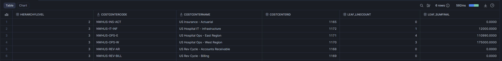
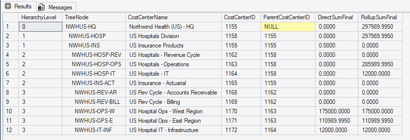
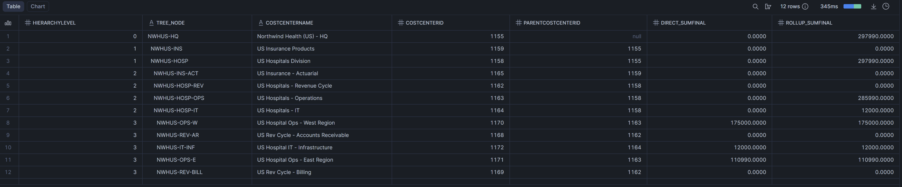
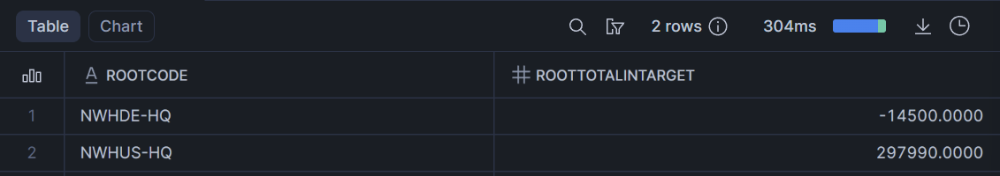

# snowconvert-financial-planning-migration

This repository contains my migration of a SQL Server–based financial planning application to Snowflake.  
The work focuses primarily on migrating and validating the stored procedure **`usp_ProcessBudgetConsolidation`**, along with the schema and supporting logic it depends on.

The goal of the migration was to preserve the business behavior of the original implementation while adapting it to Snowflake’s set-based execution model.

---

## Scope of Work

I completed the following:

- Migration of the Planning schema and core tables
- Migration of hierarchy-related logic required for consolidation
- A complete Snowflake implementation of:
  - **`usp_ProcessBudgetConsolidation`**
- Supporting procedures, views, and validation scripts needed to test correctness

Other stored procedures included in the assignment were reviewed to understand dependencies and patterns, but were not fully migrated.

---

## Use of AI

I used AI as a supporting tool primarily for understanding and reasoning, not as a substitute for design or implementation.

AI was used to:
- Identify SQL Server features that do not translate directly to Snowflake (for example, cursors and table-valued parameters)
- Build a quick understanding of common financial planning concepts used in the schema (cost center hierarchies, consolidation behavior)
- Generate high-level summaries of SQL Server procedures to separate business intent from SQL Server–specific implementation details

---

## Design Approach

Rather than translating the SQL Server procedure line by line, I focused on capturing the core behavior of the consolidation process in a way that fits Snowflake well.

Key choices included:
- Replacing cursor-based hierarchy traversal with a materialized hierarchy table
- Using set-based aggregations instead of procedural row-by-row logic
- Treating consolidation output as a deterministic, queryable result scoped by a generated `RunID`

This preserves the intent of the original procedure while avoiding SQL Server–specific constructs that do not map cleanly to Snowflake.

---

## Testing and Validation Overview

Validation focused on answering a simple question:

> Does the Snowflake implementation behave the same way as the SQL Server version for the same inputs?

To answer this, I used a combination of structural checks, output comparisons, and behavioral tests.

---

## 1. Hierarchy Validation (Dependency)

The consolidation procedure depends on a correctly built cost center hierarchy.  
The supporting procedure **`sp_BuildCostCenterHierarchy`** was validated independently using basic structural checks:

- Expected number of hierarchy nodes
- Reasonable distribution of nodes by level
- Parent-child reference integrity
- Absence of duplicate or self-referencing nodes
- Consistency between hierarchy paths and levels

**Sanity check script:**  
[test_sp_BuildCostCenterHierarchy.sql](MigrationMaterials/Tests/Snowflake/SanityChecks/StoredProcedures/test_sp_BuildCostCenterHierarchy.sql)

These checks ensure the hierarchy used by consolidation is internally consistent.

## 2. Leaf-Level Totals Comparison (SQL Server vs Snowflake)

Before validating hierarchical rollups, I first confirmed that the **leaf-level financial totals** used as inputs to consolidation are identical between SQL Server and Snowflake for the same source budget.

This check verifies that:
- Source data was migrated correctly
- No duplication or loss occurred during loading
- Consolidation inputs are consistent across systems

Because consolidation math is performed entirely at the leaf level, matching results here strongly constrains the space of possible downstream errors.

**Validation scripts:**
- [Snowflake: 02_leaf_level_totals.sql](MigrationMaterials/Tests/Snowflake/Validation/Evidence/02_leaf_level_totals.sql)
- [SQL Server: 02_leaf_level_totals.sql](MigrationMaterials/Tests/SQLServer_Source/Validation/Evidence/02_leaf_level_totals.sql)

**SQL Server – Leaf-Level Totals (Source Budget):**  

**Snowflake – Leaf-Level Totals (Source Budget):**  

---

## 3. Hierarchy Rollup Comparison (SQL Server vs Snowflake)

To confirm that hierarchical aggregation behavior was preserved, I compared rollup results between SQL Server and Snowflake using the same input data.

This comparison verifies that:
- Leaf values roll up correctly to parent cost centers
- Parent totals equal the sum of their descendants
- Hierarchy boundaries are respected consistently

**Validation scripts:**
- [Snowflake: 01_hierarchy_rollup_equivalence.sql](MigrationMaterials/Tests/Snowflake/Validation/Evidence/01_hierarchy_rollup_equivalence.sql)
- [SQL Server: 01_hierarchy_rollup_equivalence.sql](MigrationMaterials/Tests/SQLServer_Source/Validation/Evidence/01_hierarchy_rollup_equivalence.sql)

**SQL Server – Hierarchical Rollup:**  

**Snowflake – Hierarchical Rollup:**  

## 4. Final Consolidated Output (Snowflake)

In Snowflake, the consolidated result is materialized as a persistent dataset.  
Validation focuses on **root-level totals**, which represent the economically meaningful results of consolidation (and avoids double-counting across hierarchy levels).

**Validation script (Snowflake):**
- [03_consolidated_root_level_totals.sql](MigrationMaterials/Tests/Snowflake/Validation/Evidence/03_consolidated_root_level_totals.sql)

**Final consolidated output (root-level totals):**

## 4. Behavioral Tests for the Consolidation Procedure

Several executable tests were used to confirm correct procedural behavior:

- Creating a new target budget when none is provided
- Appending results when a target budget already exists
- Rejecting consolidation for source budgets in invalid states
- Ensuring repeated runs are deterministic and traceable by `RunID`

**Validation scripts:**
- [03_consolidation_new_target.sql](MigrationMaterials/Tests/Snowflake/Validation/03_consolidation_new_target.sql)
- [04_consolidation_target_provided.sql](MigrationMaterials/Tests/Snowflake/Validation/04_consolidation_target_provided.sql)
- [05_consolidation_status_validation.sql](MigrationMaterials/Tests/Snowflake/Validation/05_consolidation_status_validation.sql)
- [06_consolidation_run_traceability.sql](MigrationMaterials/Tests/Snowflake/Validation/06_consolidation_run_traceability.sql)

These tests validate control flow and business rules without relying on visual comparisons.

## 5. Post-Run Sanity Checks

After a successful consolidation run, a small set of sanity checks is used to validate output integrity:

- Rows were written for the run
- No NULL financial values were produced
- No duplicate rows at the intended `(GLAccountID, CostCenterID, FiscalPeriodID)` grain
- All dimensional references are valid
- The target budget correctly links back to the source budget

**Sanity check script:**  
[test_usp_ProcessBudgetConsolidation.sql](MigrationMaterials/Tests/Snowflake/SanityChecks/StoredProcedures/test_usp_ProcessBudgetConsolidation.sql)

These checks are run against a representative execution and can be reused for any run.
